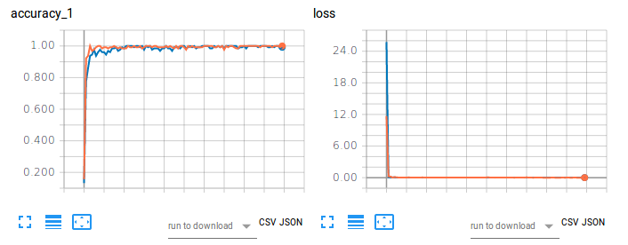
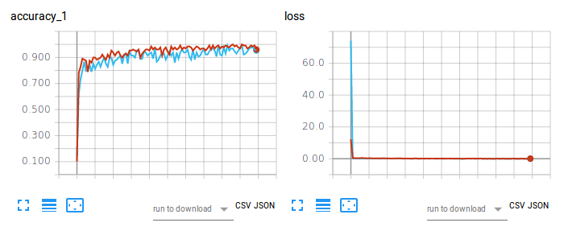

An Architecture Combining Convolutional Neural Network (CNN) and Linear Support Vector Machine (SVM) for Image Classification
===


[](https://zenodo.org/badge/latestdoi/113296846)

[]()

*This project was inspired by Y. Tang's [Deep Learning using Linear Support Vector Machines](https://arxiv.org/abs/1306.0239)
(2013).*

The full paper on this project may be read at [arXiv.org](https://arxiv.org/abs/1712.03541).

## Abstract

Convolutional neural networks (CNNs) are similar to "ordinary" neural networks in the sense that they are made up of hidden layers consisting of neurons with "learnable" parameters. These neurons receive inputs, performs a dot product, and then follows it with a non-linearity. The whole network expresses the mapping between raw image pixels and their class scores. Conventionally, the Softmax function is the classifier used at the last layer of this network. However, there have been studies ([Alalshekmubarak and Smith, 2013](http://ieeexplore.ieee.org/abstract/document/6544391/); [Agarap, 2017](http://arxiv.org/abs/1709.03082); [Tang, 2013](https://arxiv.org/abs/1306.0239)) conducted to challenge this norm. The cited studies introduce the usage of linear support vector machine (SVM) in an artificial neural network architecture. This project is yet another take on the subject, and is inspired by (Tang, 2013). Empirical data has shown that the CNN-SVM model was able to achieve a test accuracy of ~99.04% using the MNIST dataset ([LeCun, Cortes, and Burges, 2010](http://yann.lecun.com/exdb/mnist/)). On the other hand, the CNN-Softmax was able to achieve a test accuracy of ~99.23% using the same dataset. Both models were also tested on the recently-published Fashion-MNIST dataset ([Xiao, Rasul, and Vollgraf, 2017](https://arxiv.org/abs/1708.07747)), which is suppose to be a more difficult image classification dataset than MNIST ([Zalandoresearch, 2017](http://github.com/zalandoresearch/fashion-mnist)). This proved to be the case as CNN-SVM reached a test accuracy of ~90.72%, while the CNN-Softmax reached a test accuracy of ~91.86%. The said results may be improved if data preprocessing techniques were employed on the datasets, and if the base CNN model was a relatively more sophisticated than the one used in this study.

## Usage

First, clone the project.
```bash
git clone https://github.com/AFAgarap/cnn-svm.git/
```

Run the `setup.sh` to ensure that the pre-requisite libraries are installed in the environment.
```bash
sudo chmod +x setup.sh
./setup.sh
```

Program parameters.
```bash
usage: main.py [-h] -m MODEL -d DATASET [-p PENALTY_PARAMETER] -c
               CHECKPOINT_PATH -l LOG_PATH

CNN & CNN-SVM for Image Classification

optional arguments:
  -h, --help            show this help message and exit

Arguments:
  -m MODEL, --model MODEL
                        [1] CNN-Softmax, [2] CNN-SVM
  -d DATASET, --dataset DATASET
                        path of the MNIST dataset
  -p PENALTY_PARAMETER, --penalty_parameter PENALTY_PARAMETER
                        the SVM C penalty parameter
  -c CHECKPOINT_PATH, --checkpoint_path CHECKPOINT_PATH
                        path where to save the trained model
  -l LOG_PATH, --log_path LOG_PATH
                        path where to save the TensorBoard logs
```

Then, go to the repository's directory, and run the `main.py` module as per the desired parameters.
```bash
cd cnn-svm
python3 main.py --model 2 --dataset ./MNIST_data --penalty_parameter 1 --checkpoint_path ./checkpoint --log_path ./logs
```

## Results

The hyperparameters used in this project were manually assigned, and not through optimization.

|Hyperparameters|CNN-Softmax|CNN-SVM|
|---------------|-----------|-------|
|Batch size|128|128|
|Learning rate|1e-3|1e-3|
|Steps|10000|10000|
|SVM C|N/A|1|

The experiments were conducted on a laptop computer with Intel Core(TM) i5-6300HQ CPU @ 2.30GHz x 4, 16GB of DDR3 RAM,
and NVIDIA GeForce GTX 960M 4GB DDR5 GPU.



**Figure 1. Training accuracy (left) and loss (right) of CNN-Softmax and CNN-SVM on image classification using
[MNIST](http://yann.lecun.com/exdb/mnist/).**

The orange plot refers to the training accuracy and loss of CNN-Softmax, with a test accuracy of 99.22999739646912%.
On the other hand, the blue plot refers to the training accuracy and loss of CNN-SVM, with a test accuracy of
99.04000163078308%. The results do not corroborate the findings of [Tang (2017)](https://arxiv.org/abs/1306.0239)
for [MNIST handwritten digits](http://yann.lecun.com/exdb/mnist/) classification. This may be attributed to the fact
that no data preprocessing nor dimensionality reduction was done on the dataset for this project.



**Figure 2. Training accuracy (left) and loss (right) of CNN-Softmax and CNN-SVM on image classification using [Fashion-MNIST](http://github.com/zalandoresearch/fashion-mnist).**

The red plot refers to the training accuracy and loss of CNN-Softmax, with a test accuracy of 91.86000227928162%.
On the other hand, the light blue plot refers to the training accuracy and loss of CNN-SVM, with a test accuracy of
90.71999788284302%. The result on CNN-Softmax corroborates the finding by [zalandoresearch](https://github.com/zalandoresearch) on [Fashion-MNIST](https://github.com/zalandoresearch/fashion-mnist#benchmark).

## Citation
To cite the paper, kindly use the following BibTex entry:
```
@article{agarap2017architecture,
  title={An Architecture Combining Convolutional Neural Network (CNN) and Support Vector Machine (SVM) for Image Classification},
  author={Agarap, Abien Fred},
  journal={arXiv preprint arXiv:1712.03541},
  year={2017}
}
```

To cite the repository/software, kindly use the following BibTex entry:
```
@misc{abien_fred_agarap_2017_1098369,
  author       = {Abien Fred Agarap},
  title        = {AFAgarap/cnn-svm v0.1.0-alpha},
  month        = dec,
  year         = 2017,
  doi          = {10.5281/zenodo.1098369},
  url          = {https://doi.org/10.5281/zenodo.1098369}
}
```

## License
```
Copyright 2017-2020 Abien Fred Agarap

Licensed under the Apache License, Version 2.0 (the "License");
you may not use this file except in compliance with the License.
You may obtain a copy of the License at

   http://www.apache.org/licenses/LICENSE-2.0

Unless required by applicable law or agreed to in writing, software
distributed under the License is distributed on an "AS IS" BASIS,
WITHOUT WARRANTIES OR CONDITIONS OF ANY KIND, either express or implied.
See the License for the specific language governing permissions and
limitations under the License.
```
